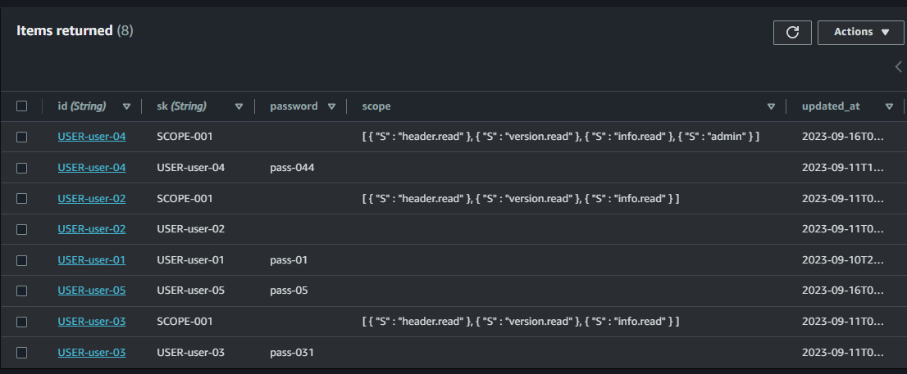

# lambda-go-autentication

POC Lambda for technical purposes

Lambda mock a login and return a JWT/Scope Oath using a HS256 (symetric key) The JWT token is 60 minutes duration

It saves the credentials and scopes in a DynamoDB table

See: lambda-go-auth-apigw (extend example)

## Enviroment variable

+ tablename: DynamoDB table

+ jwtKey: The KEY used for encrypt Hs256

## Compile lambda

   Manually compile the function

      GOOD=linux GOARCH=amd64 go build -o ../build/main main.go

      zip -jrm ../build/main.zip ../build/main

      aws lambda update-function-code \
        --function-name lambda-go-autentication \
        --zip-file fileb:///mnt/c/Eliezer/workspace/github.com/lambda-go-autentication/build/main.zip \
        --publish

## Endpoints

+ POST /signIn

      {
         "user": "007",
         "password": "MrBeam",
      }

+ POST /login

      {
         "user": "007",
         "password": "MrBeam",
      }

+ POST /tokenValidation

      {
         "token": "ABC123",
      }

+ POST /refreshToken

      {
         "token": "ABC123",
      }

+ POST /addScope

      {
         "user": "user-01",
         "scope": ["test.read","test.write"]
      }

+ GET /credentialScope/user-01

## Pipeline

Prerequisite: 

Lambda function already created

+ buildspec.yml: build the main.go and move to S3
+ buildspec-test.yml: make a go test using services_test.go
+ buildspec-update.yml: update the lambda-function using S3 build
+ appspec.yml: blue/gree deploy